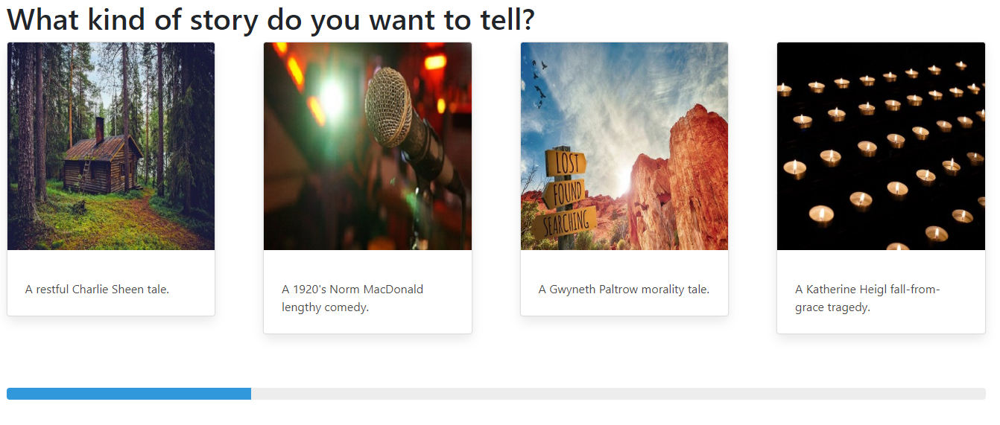
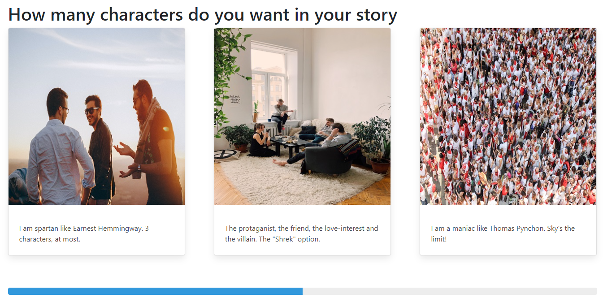
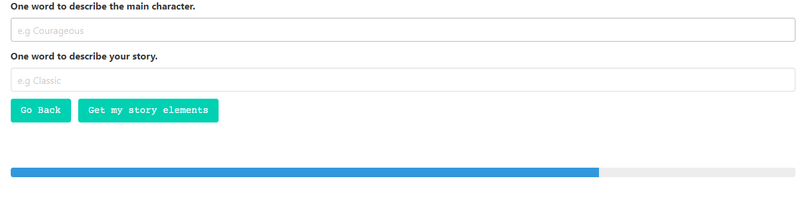
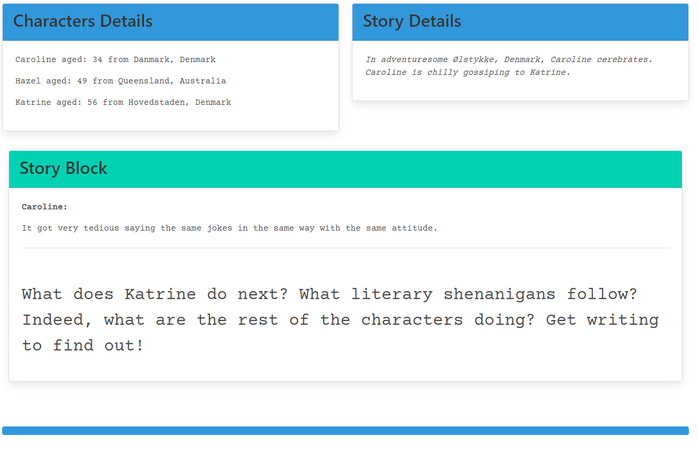

# StoryFinder
With this application, you will no longer have writers block! Simply answer a few questions and this application will provide you with the necessary building blocks you have been looking for. So please follow along as we dive into what makes this application tick!
Bulma:
This application is built with the easy to use CSS framework Bulma, to learn more about this framework please visit : https://bulma.io/
Apis:
With the help of multiple APIs we are able to provide you with character names, ages, birth places, quotes, and more.
### Lets take a look at how this application works:
1. Question one give you the option to pick what kind of story you would like to tell. 

2. Question two lets you choose how many characters you want in your story.

3. Question three actually consists of two seperate questions. With these questions we let you have your own touch in creating this story.

4. Lastly, you are presented with your story page. Here you are given your characters, quotes, and a jumpstart on your next masterpeice!
